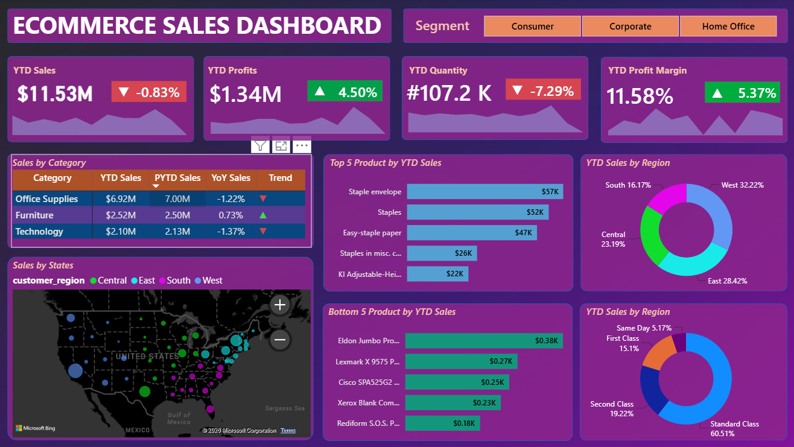

# E-Commerce Sales Dashboard | Power BI

An end-to-end E-Commerce Sales Analytics project developed using Microsoft Power BI to transform raw sales data into an interactive business intelligence dashboard.

## 📊 Dashboard Overview

The dashboard provides an interactive view of:

- YTD Sales
- YTD Profit
- Quantity Sold
- Profit Margin
- Product Performance
- Regional Sales
- Customer Segment Analysis
- State-level Performance
- Sales and Profit Trends

## 🛠️ Tools & Technologies

- Microsoft Power BI
- DAX
- Power Query
- Microsoft Excel
- Data Modeling
- Data Visualization
- Business Intelligence

## 🔄 Project Workflow

1. Data Collection
2. Data Cleaning & Transformation
3. Data Modeling
4. DAX Measures & Calculations
5. KPI Development
6. Dashboard Design
7. Interactive Filtering & Slicers
8. Business Insights

## 📈 Key Features

- Interactive slicers and filters
- KPI cards
- Sales and profit analysis
- Product-level analysis
- Regional performance analysis
- Customer segment analysis
- Interactive charts and visualizations

## 🖼️ Dashboard Preview

## 🎥 Project Demo

A short walkthrough video demonstrates the interactive Power BI dashboard.

## 🎯 Objective

The objective of this project is to analyze e-commerce sales data and create an interactive dashboard that helps users understand business performance and identify important sales and profitability patterns.

## 👨‍💻 Skills Demonstrated

Power BI • DAX • Data Cleaning • Data Modeling • Data Analysis • Data Visualization • Business Intelligence
